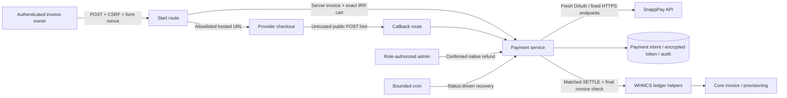
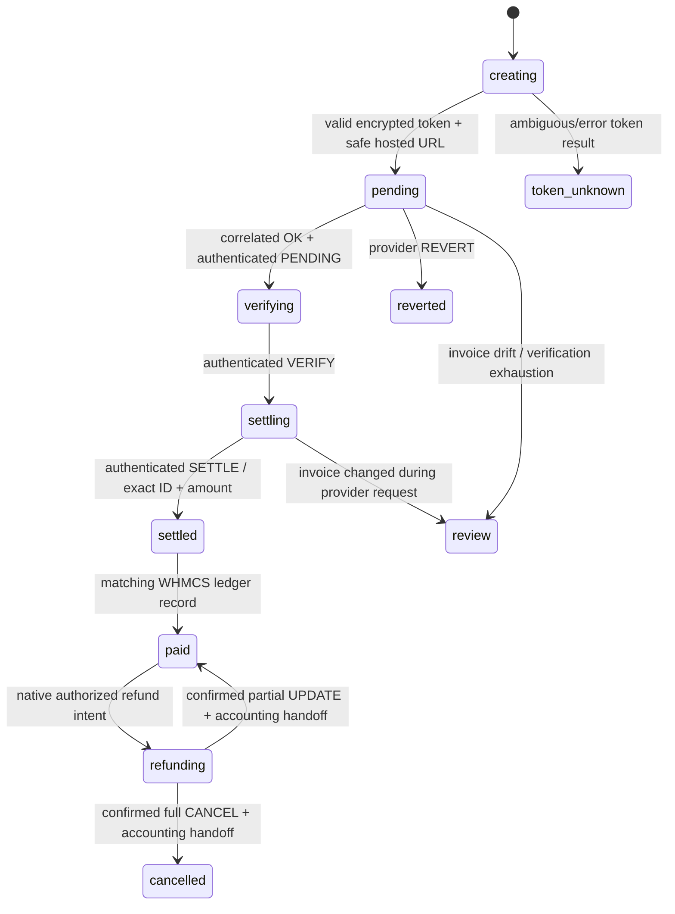

# Payment trust and recovery boundaries

Connection-scoped invoice lock spans provider/ledger work without a long SQL transaction. Durable state precedes each mutation. Exact original balance remains immutable; current remaining provider amount/cart changes only after confirmed refund. Snapshot/provider authentication controls accounting, not callback state. WHMCS owns invoice totals, native refund bookkeeping, provisioning, notifications and permissions.

Unknown token and review states require operator investigation. Refund intent remains until native WHMCS ledger matches saved refund ID/amount; subsequent calls cannot receive the same handed-off success twice. Read-only provider inspection works independently of terminal/review recovery decisions.
